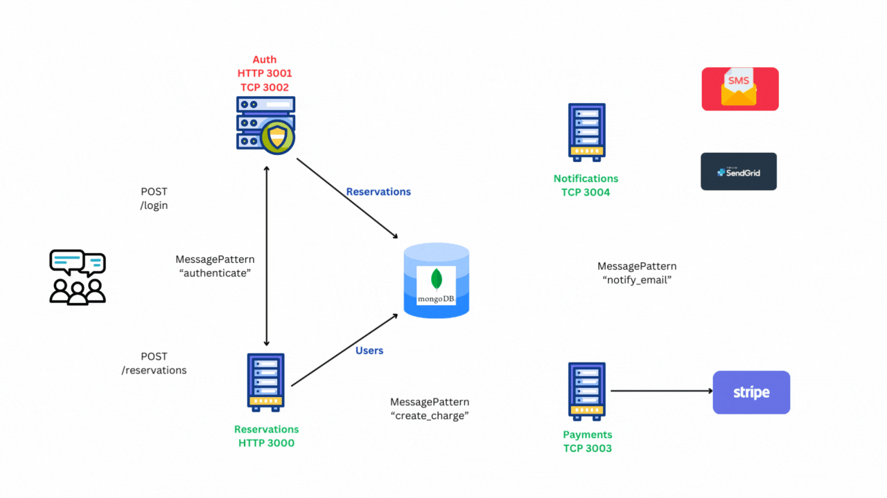

# 🗓️Bookify.io - Reservation Booking System

**Bookify.io** is a cutting-edge, production-grade backend designed with four independent microservices, seamlessly integrated using a robust NestJS microservice architecture. Built from the ground up, this system prioritizes scalability and simplicity, adhering strictly to best practices.

- **Scalable Architecture:** A real-world reservation booking system that handles real payments, user billing, and reservation persistence to a MongoDB database.
- **Comprehensive Functionality:** Features include accepting payment through Stripe payment, sending notifications via SMS and Email, and cloud deployment on the AWS Cloud, ensuring a reliable and efficient service.

## 🏗️Monorepo & Common Library

- **Common Library:** A common library was established to provide shared functionalities for all microservices, such as database access, authentication, logging, and more. This approach ensures that common code is written once and imported into each microservice, eliminating the need to rewrite code for cross-cutting concerns.
- **Monorepo Structure:** The Nest CLI facilitated the conversion of the standalone project into a **Monorepo**. This structure allows the common shared module to coexist alongside each microservice, streamlining development and maintenance.

## 📂Abstract Repository Pattern

In the common library, the **data persistence layer** was designed using an ***abstract repository pattern*** connected to MongoDB. This pattern was kept generic to allow for easy swapping of the data persistence layer at any time.

A migration from **MongoDB to MySQL** was later performed to implement **RBAC** (Role-Based Access Control) more effectively. The reasons for this migration include:

- **Flexible Role Management:** When creating a new user (either a *customer* or *admin*), the system should allow the selection of existing roles or the creation of new roles. For existing roles, only the role ID needs to be provided. For new roles, the role name is provided, and a new entry is created in the roles table.
- **Complex Role Structures:** Beyond the basic admin and customer roles, various roles exist within these categories, such as Super Admin, Admin, and Moderator for admins, or Free, Pro, Premium, and Enterprise for customers. An SQL database is ideal for managing these roles and their relationships efficiently.
- **Dynamic Route Protection:** A **decorator** was created to set roles for specific routes. This approach is not hardcoded, allowing roles to be added or removed as needed, providing significant flexibility in managing access control.

## 🔒Auth Microservice

- **Comprehensive Authentication and Identity Management:** The Auth microservice handles all authentication and identity access management functionalities for the application. It implements **JWT authentication** using best practices with **PassportJS**, incorporating multiple strategies to ensure secure and flexible authentication.
- **Common Auth Guard:** A **common auth guard** is implemented, which all services can use to authenticate users and protect routes. This centralized guard streamlines the authentication process across microservices, ensuring consistent security measures.
- **Role-Based Access Control (RBAC):** RBAC is implemented to provide different roles to users and ensure that only users with specific roles can access certain routes. This ensures fine-grained access control, enhancing security by restricting access based on user roles.

## 📬Notification Microservice

- **Initial Setup with TCP:** By default, the notification service used the **`TCP`** transport layer, working on EventPattern to accept events emitted from other microservices. It then utilized **Twilio** to send SMS and **SendGrid** to send emails to users.
- **Enhancing Reliability with RabbitMQ:** The TCP transport layer was later replaced with a message queue like RabbitMQ. This change ensured that if any message could not be processed, the data in the message would not be lost. Instead, it would be stored in the exchange of the RabbitMQ cluster, achieving high reliability. This setup allows the system to queue messages and process them reliably, ensuring that notifications are not lost even if there are temporary failures in the service.

## 💳Payment Microservice

- By default, the payments service relies **`TCP`** transport layer to work on EventPattern to be able to accept events emitted from the Reservation microservice and then use Stripe API to actually accept real payment credentials and actually be able to bill our users properly.
- Later, the **`TCP`** transport layer was replaced by grpc...

## 📨Communication: From TCP to gRPC & RabbitMQ

<p align="center">
  
</p>
- **Initial Setup with TCP:** Initially, all four microservices communicated via the **`TCP`** transport layer in Nest.js.
- **Identifying the Problem:** The main issue with using TCP was the lack of message reliability. For instance, if the payment service successfully charged a customer and sent a request to the notification service to send an SMS and email, but the notification service failed, the request would be lost. This inability to retry failed messages and the lack of queuing led to potential message loss and system overload during high traffic.
- **Implementing the Solution with RabbitMQ:** Transitioning to asynchronous communication with RabbitMQ introduced the concept of a queue. This queue holds messages until they are ready to be processed, ensuring reliable message delivery. If there is a large backlog of messages, they are processed one at a time, preventing system overload. Additionally, failed messages can be re-queued and retried, ensuring no data is lost and enhancing the system's reliability and resilience.

## ❄️API Gateway: GraphQL-Apollo Federation
- **Problem with the initial Setup:** In the beginning, the system had a straightforward setup. All incoming requests were handled by the **`Reservations`** & **`Auth`** microservice. Reservation service was the entry points for everything—CRUD operations for reservations, and Auth service for user authentication, and authorization. It worked, but as the system grew, this setup started to feel limiting. We were exposing multiple endpoints, each tied to a specific microservice. The system was becoming harder to manage, and it was clear we needed a more efficient way to handle API requests.
- **The Solution - Apollo Federation:** We turned to Apollo Federation to streamline this complexity. By stitching together multiple microservices into a single, unified GraphQL endpoint, Apollo Federation allowed us to expose just one API gateway to our users, while keeping the underlying services separate and specialized.


## 🚀Production Deployment

- **Automated Builds with AWS CodeBuild:** The project leverages AWS CodeBuild and a **`buildspec.yaml`** file to set up automated builds. AWS CodePipeline detects new commits automatically and triggers new builds, ensuring seamless continuous integration and delivery.
- **Local Development with Minikube, Docker, and Helm:** During development, all four microservices run inside Docker containers managed by Minikube. Helm charts are used to generate `deployment.yaml` and `service.yaml` files for each microservice, streamlining the deployment process. This setup closely mimics the production environment, enabling consistent testing and early detection of issues.
- **Container Images and AWS ECR:** All four microservice images are pushed to private repositories on AWS Elastic Container Registry (ECR). AWS CloudFormation is then used to automate the creation and management of EC2 instances with a YAML file.
- **CI/CD Pipeline with AWS CodePipeline:** AWS CodePipeline automates the CI/CD process, integrating AWS CodeBuild for building and AWS EKS for deploying the application. The deployment provisions a MongoDB Atlas instance in the ap-south-1 region and exposes the application with a real load balancer, ensuring a scalable and reliable production environment.

## 🐞Debugging Setup

To facilitate debugging, a debugger was connected to the microservices running in Docker. This setup allows for the inspection of defined variables and control flow as requests enter the HTTP server, making it invaluable for diagnosing issues and understanding the code's behavior.

- **Listening for Debug Requests:** An address was specified to listen for debug requests, with the IP set to **0.0.0.0** to capture all IP addresses within the container. The debugging port, such as 9229, was designated for this purpose.
- **Debug Configuration in `package.json`:** A debug script was added to **`package.json`**:
    
    ```json
    "start:debug": "nest start --debug 0.0.0.0:9229 --watch"
    ```
    
- **Docker-Compose Debug Command:** To debug a specific service, the `command` property in **docker-compose** needs to be modified. For example, to debug the reservation service, change:
    
    ```yaml
    command: pnpm run start:dev reservations
    ```
    
    to:
    
    ```yaml
    command: pnpm run start:debug reservations
    ```
    
- **IDE Debugger Connection:** Finally, connect the debugger in your IDE. In VSCode, create a **`launch.json`** file and configure it to connect to the debugging port.

This approach ensures an efficient and effective debugging process, providing deeper insights into the application's runtime behavior.
